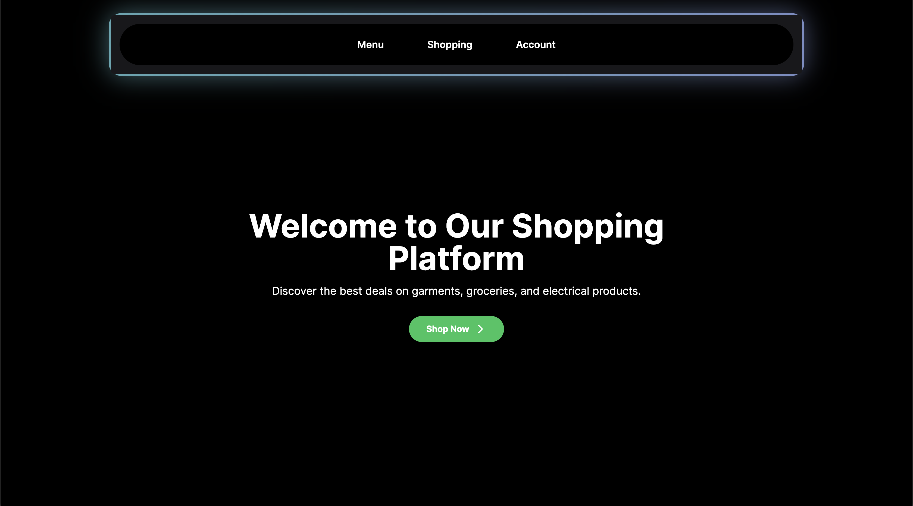
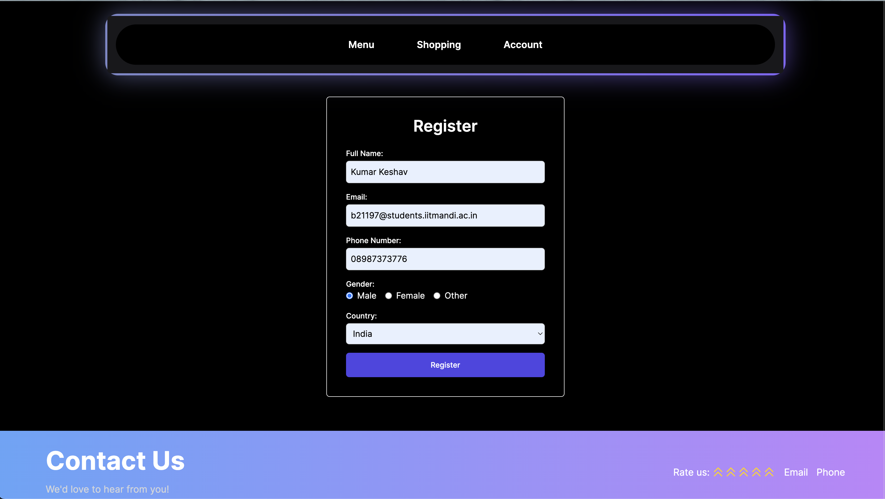
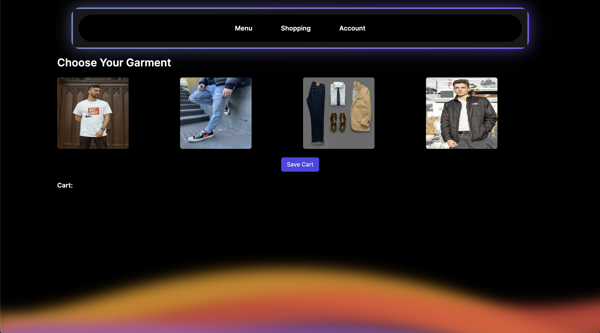
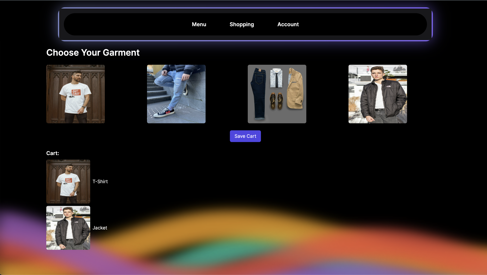

# Shopping Website App

This is a Shopping Website application built with Next.js, featuring three main pages and various functionalities to enhance the shopping experience.

## Overview

The Shopping Website app consists of three main pages:

1. **Home Page**: The home page showcases a stylish layout with a navbar containing three tabs adorned with a glowing background effect. Users can easily navigate between different sections of the application from the home page.

2. **Registration Page**: Users can access the registration page from the navbar, where they are prompted to fill in some basic details. Upon submission, the form data is processed and stored securely.

3. **Shopping Page**: The shopping tab allows users to explore a wide range of garments available for purchase. Users can browse through different categories, view product images, and add items to their cart. Additionally, there is an option to save the cart data for future reference.

## Features

- **Stylish Layout**: The application features a visually appealing layout with modern styling elements, providing users with an engaging browsing experience.

- **Responsive Navbar**: The navbar at the top of the page ensures easy navigation across different sections of the application. It contains three tabs, each serving a specific purpose.

- **Glowing Background Effect**: The tabs in the navbar are highlighted with a glowing background effect, adding a touch of elegance to the overall design.

- **Functional Menus**: The menus for home and registration are fully functional, allowing users to seamlessly switch between pages and access the registration form to input their details.

- **Garments Selection**: The shopping tab offers a wide selection of garments for users to browse through. Each item is accompanied by an image, making it easier for users to visualize their choices.

- **Cart Management**: Users can add items to their cart and save their selections for later. The cart management functionality ensures a smooth shopping experience, allowing users to review and modify their cart contents as needed.

- **Wavy Background Effect**: Throughout the application, a wavy background effect adds a touch of dynamism and visual interest, enhancing the overall aesthetic appeal.

## Technologies Used

- **Next.js**: Next.js is used as the framework for building the Shopping Website application, providing a robust foundation for server-side rendering and routing.

- **MongoDB**: MongoDB serves as the backend database for storing user information and cart data securely.

- **Tailwind CSS**: Tailwind CSS is utilized for styling the application, offering a utility-first approach to building user interfaces with minimal effort.

## Getting Started

To get started with the Shopping Website app, follow these steps:

1. Clone the repository to your local machine.
2. Install the necessary dependencies using npm, yarn, or pnpm.
3. Run the development server using the provided script (`npm run dev`, `yarn dev`, `pnpm dev`).
4. Open [http://localhost:3000](http://localhost:3000) in your web browser to view the application.

## Screenshots

### Home Page

### Registration Page

### Shopping Page

## Feedback and Contributions

Feedback and contributions to the Shopping Website app are welcome! If you encounter any issues or have suggestions for improvement, please don't hesitate to open an issue or submit a pull request on GitHub.

Happy shopping!
