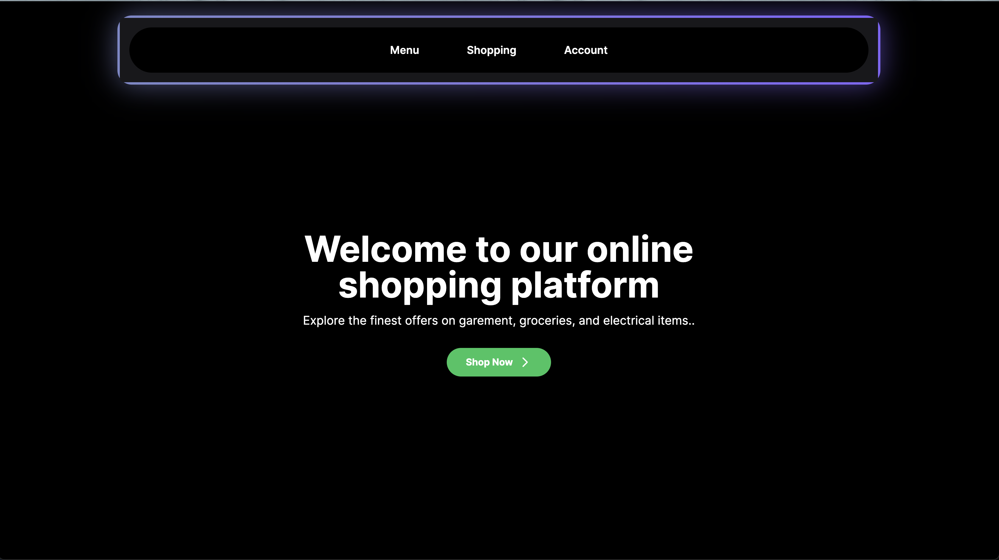

# Shopping Website Repository

This repository contains the source code for a simple shopping website with three main sections: Home Page, Registration Page, and Shopping Page.
## Overview

The Shopping Website app consists of three main pages:

1. **Home Page**: The home page showcases a stylish layout with a navbar containing three tabs adorned with a glowing background effect. Users can easily navigate between different sections of the application from the home page.

2. **Registration Page**: Users can access the registration page from the navbar, where they are prompted to fill in some basic details. Upon submission, the form data is processed and stored securely.

3. **Shopping Page**: The shopping tab allows users to explore a wide range of garments available for purchase. Users can browse through different categories, view product images, and add items to their cart. Additionally, there is an option to save the cart data for future reference.
## Features

- **Home Page**: A landing page showcasing featured products and promotions.
- **Registration Page**: Allows users to sign up for an account by providing necessary details.
- **Shopping Page**: Enables users to browse and purchase items from the store.

## Technologies Used

- **Frontend**:
  - Next.js (for server-side rendering and routing)
  - Tailwind CSS (for styling)
- **Backend**:
  - MongoDB (for database)

## Structure

- **/pages**: Contains the Next.js pages for each section (home, registration, shopping).
- **/components**: Includes reusable components used across the website.
- **/styles**: Contains global styles and Tailwind CSS configuration.
- **/api**: Backend API endpoints for user authentication and product management.
- **/public**: Static assets such as images and icons.
- **/utils**: Utility functions and helper modules.

## Getting Started

To get started with the Shopping Website app, follow these steps:

1. Clone the repository to your local machine.
2. Install the necessary dependencies using npm, yarn, or pnpm.
3. Run the development server using the provided script (`npm run dev`, `yarn dev`, `pnpm dev`).
4. Open [http://localhost:3000](http://localhost:3000) in your web browser to view the application.

## Screenshots

### Home Page

### Registration Page

### Shopping Page

## Feedback and Contributions

Contributions to the project are welcome! You can contribute by fixing bugs, adding new features, or improving documentation. Please follow the guidelines outlined in the CONTRIBUTING.md file.

